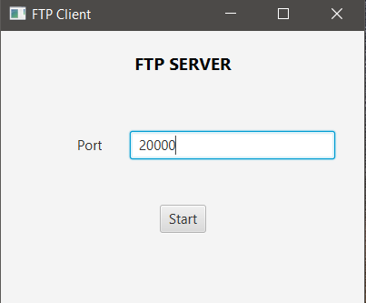
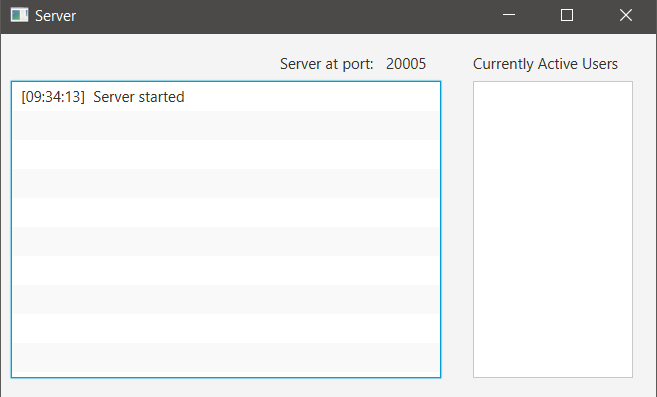
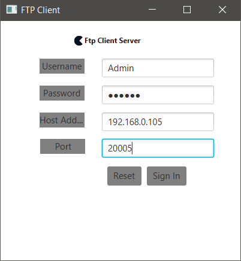
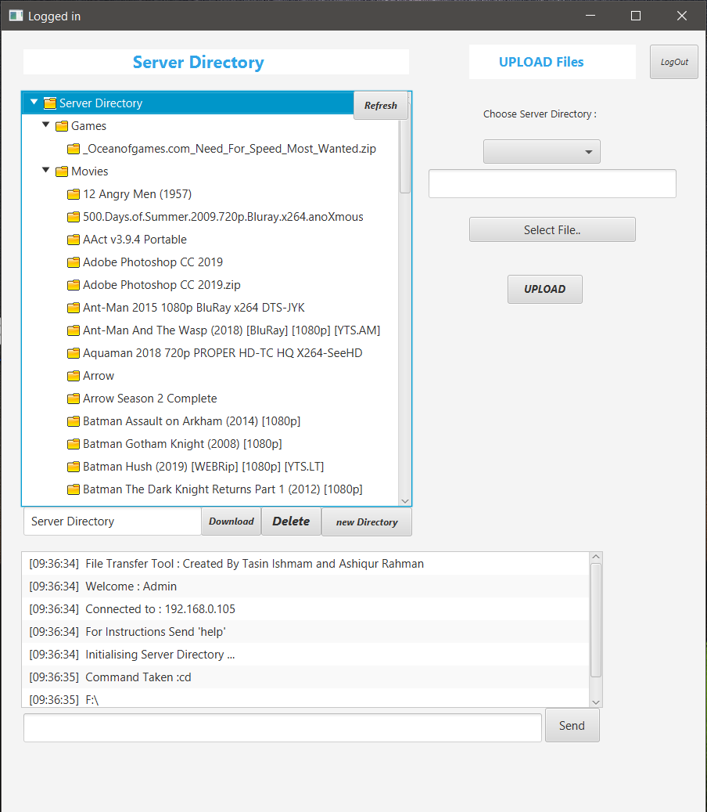
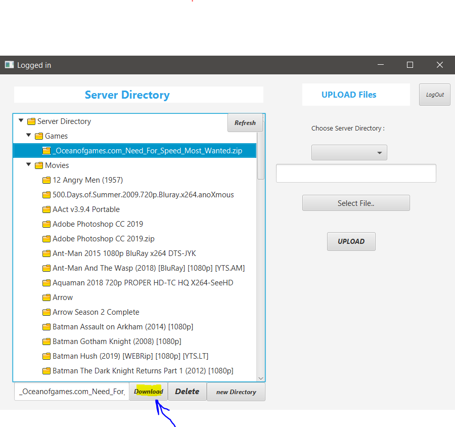
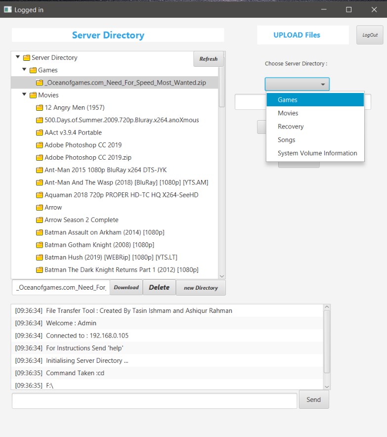
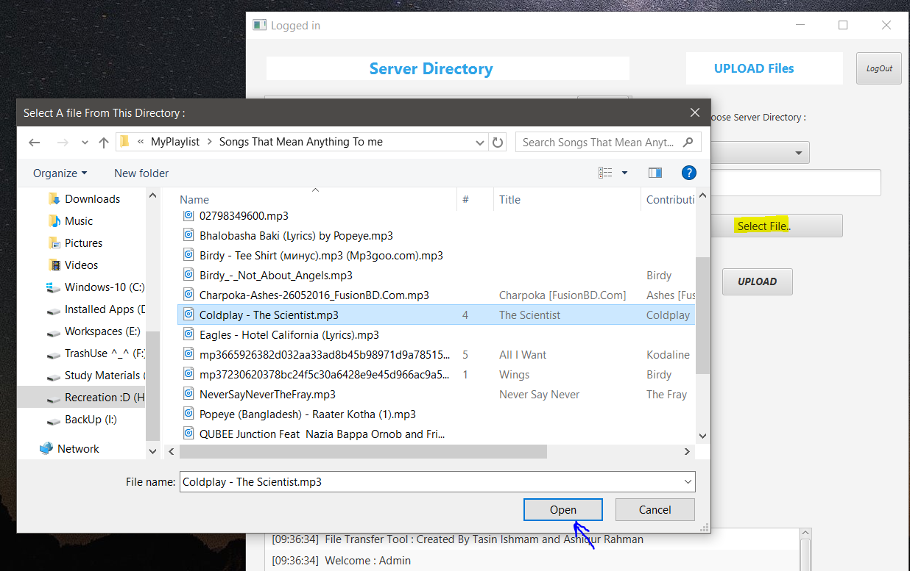
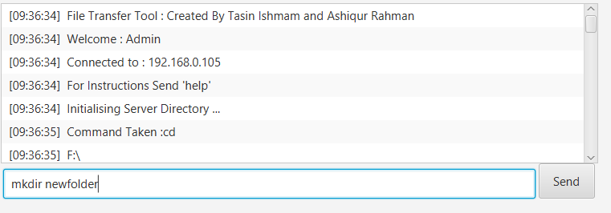

## User Guide
#####
### Setup
#### Both Receiver And Sender should Connect to the same network(e.g same wifi). Move Server.jar file to the folder where 'the file you want to send' exists.
#### Run Server.jar, enter a port(20000+) (default 20000)

#### Server is successfully running on specified port

#### Open ftpClient.jar on the folder where you want to receive the file. Run ipconfig on server pc and get the ipAddress of the server.Keep username and password as it is, And Enter the correct server ipAddress and port

#### Login and you should see the entire file explorer treeview of the server root directory.

### Usage
#### Download a file from the Server.
##### Select the file you wish to download and press download.Watch progress on the logs in the bottom.

#### Upload a file to the Server.
##### Select the folder in which you want to upload your file. You can make your own folder as well.

##### Press 'Select File' and you should see a file browser like this. Select the file you wish to upload and press 'open'

#### If u dont want to use the GUI, you still have a terminal that supports basic ftp commands like: pwd,cd,ls,mkdir etc. Enter command 'help' for a list of supported commands,

